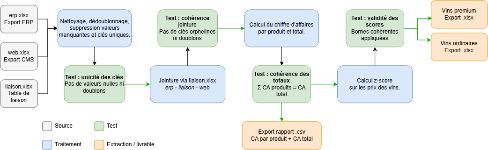

## Context

Ce projet a été réalisé dans le cadre de mon parcours de formation 'Data Engineer' avec OpenClassrooms.

Titre du projet :

`Mettez en place un pipeline d'orchestration des flux`

Ce projet consiste à 

---

## Installations

### Docker

[Docker Desktop](https://www.docker.com/products/docker-desktop/) (windows/mac)

[Docker Engine](https://docs.docker.com/engine/install/) (Linux)

---

## Commandes utiles

**Docker**
- `docker compose up` (voir le démarrage et le debug en direct)
- `docker compose up -d` (lancer l’environnement puis continuer à travailler)
- `docker compose down -v` (supprime les conteneurs et les volumes associés)

UI kestra disponible : `http://localhost:8080/`

# Déroulé complet du docker-compose.yml :